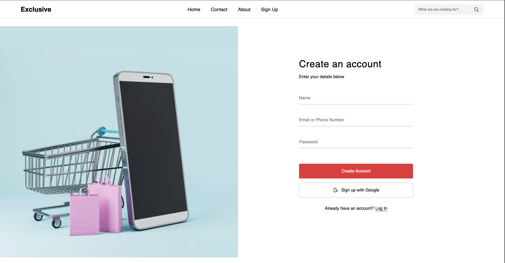

# 🛒 E-Commerce Website

A modern and responsive E-Commerce website built using **React.js + Vite**.


#img



## 📁 Project Structure

```text
E-commerce/
│
├── E-Commerce-app/
│   ├── public/
│   │   ├── assets/
│   │   └── vite.svg
│   │
│   ├── src/
│   │   ├── assets/
│   │   │   ├── about/
│   │   │   ├── category/
│   │   │   ├── exploreProducts/
│   │   │   ├── featured/
│   │   │   ├── footer/
│   │   │   ├── hero/
│   │   │   ├── payment/
│   │   │   ├── products/
│   │   │   ├── sign-up/
│   │   │   └── speaker/
│   │   │
│   │   ├── components/
│   │   │   ├── AccountPage/
│   │   │   ├── Cart/
│   │   │   ├── category/
│   │   │   ├── ExploreProducts/
│   │   │   ├── Featured/
│   │   │   ├── Footer/
│   │   │   ├── Hero/
│   │   │   ├── Home/
│   │   │   ├── MusicBanner/
│   │   │   ├── Navbar/
│   │   │   ├── product/
│   │   │   ├── sellingProducts/
│   │   │   ├── Sidebar/
│   │   │   └── Wishlist/
│   │   │
│   │   ├── context/
│   │   │   ├── CartContext.jsx
│   │   │   ├── CategoryContext.jsx
│   │   │   ├── SearchContext.jsx
│   │   │   └── WishlistContext.jsx
│   │   │
│   │   ├── data/
│   │   │   ├── products.js
│   │   │   └── recommended.js
│   │   │
│   │   ├── pages/
│   │   │   ├── About/
│   │   │   ├── AllProducts/
│   │   │   ├── Checkout/
│   │   │   ├── Contact/
│   │   │   ├── ProductDetails/
│   │   │   └── Profile/
│   │   │
│   │   ├── App.jsx
│   │   └── main.jsx
│   │
│   ├── package.json
│   ├── vite.config.js
│   └── README.md
│
└── .gitignore
```


## 📂 GitHub Repository

https://github.com/lalit-sahu-iphtech/E-commerce

---

## ✨ Features

- User Authentication (Local Storage)
- Product Listing
- Product Details Page
- Category Filtering
- Search Products
- Wishlist
- Shopping Cart
- Checkout Page
- User Profile
- About Page
- Contact Page
- Responsive Design

---

## 🛠️ Tech Stack

- React.js
- Vite
- React Router DOM
- Context API
- CSS3
- Local Storage
- React Icons

---

## 📥 Clone the Repository

```bash
git clone https://github.com/lalit-sahu-iphtech/E-commerce.git
```

---

## 📂 Go to Project Folder

```bash
cd E-commerce/E-Commerce-app
```

---

## 📦 Install Dependencies

```bash
npm install
```

---

## ▶️ Run the Project

```bash
npm run dev
```

Open your browser:

```
http://localhost:5173
```

---

## 📦 Build for Production

```bash
npm run build
```

---

## 👨‍💻 Author

**Lalit Kumar Sahu**

GitHub: https://github.com/lalit-sahu-iphtech
